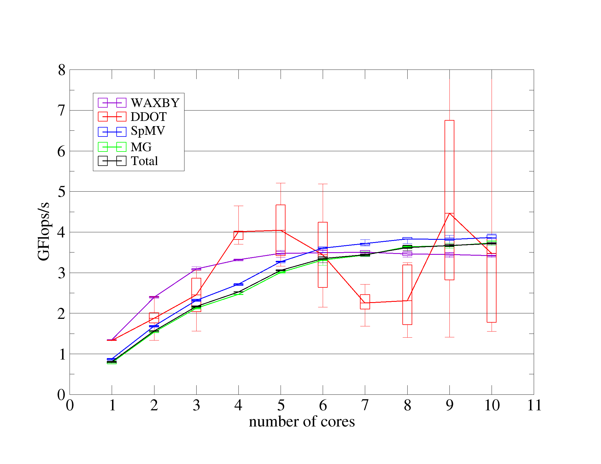
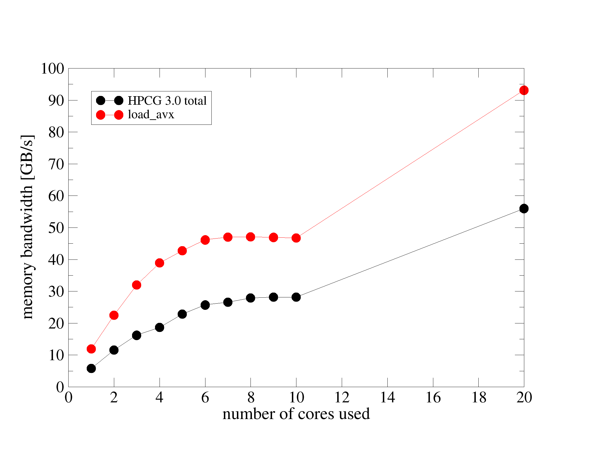
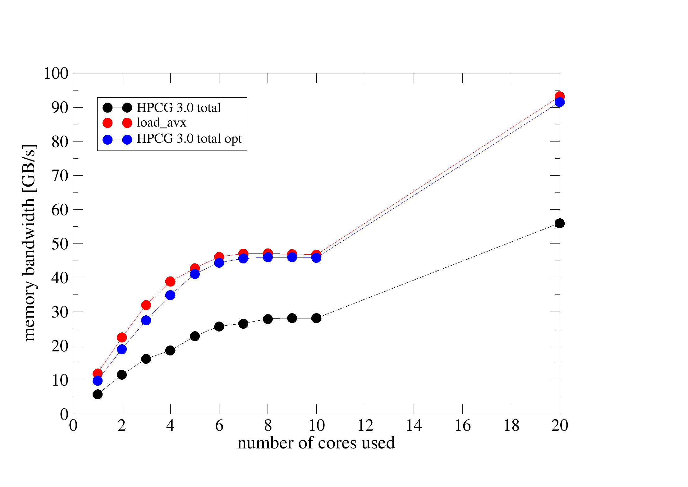

<!-----------------------------------------------------------------------------
This document should be written based on the Github flavored markdown specs:
https://github.github.com/gfm/
It can be converted to html or pdf with pandoc:
pandoc -s -o logbook.html  -f gfm -t html logbook.md
pandoc test.txt -o test.pdf
or with the kramdown converter:
kramdown --template document  -i GFM  -o html logbook.md

Optional: Document how much time was spent. A simple python command line tool
for time tracking is [Watson](http://tailordev.github.io/Watson/).
------------------------------------------------------------------------------>

<!-----------------------------------------------------------------------------
The Agenda section is a scratchpad area for planning and Todo list
------------------------------------------------------------------------------>
# Agenda


<!-----------------------------------------------------------------------------
START BLOCK PREAMBLE -  Global information required in all steps: Add all
information required to build and benchmark the application. Should be extended
and maintained during the project.
------------------------------------------------------------------------------>
# Project Description

* Start date: 02/06/2018
* Ticket ID: NA
* Home HPC center: HPC group, Erlangen Regional Computing Center
* Contact HPC center:
   * Name: Jan Eitzinger
   * Fon: -
   * E-Mail: jan.eitzinger@fau.de

<!-----------------------------------------------------------------------------
Formulate a clear and specific performance target
------------------------------------------------------------------------------>
## Target


## Customer Info

* Name: The public
* E-Mail: john.doe@foo.bar
* Fon: <PHONENUMBER>
* Web: <URL>

## Application Info

* Name: HPCG (https://www.hpcg-benchmark.org/)
* Domain: HPC Benchmark
* Version: 3.0

<!-----------------------------------------------------------------------------
All steps required to build the software including dependencies
------------------------------------------------------------------------------>
## How to build software

Execute the following steps:

1. Edit or create a build configuration in `./setup/Make.<TAG>`. I used `./setup/Make.MPI_ICPC` as base.
2. `mkdir ./build`
3. `cd ./build`
4. `/path/to/hpcg/configure MPI_ICPC`
5. `make`

**NOTICE:**
Because configure is called with absolute path *all* file paths in the Makefile
have absolute path. This can use errors if copying the hpcg directory and not 
renewing the Makefile with new path.

<!-----------------------------------------------------------------------------
Describe in detail how to configure and setup the testcases(es)
------------------------------------------------------------------------------>
## Testcase description

It is described in the file `./INSTALL` how to adopt the benchmark settings.

<!-----------------------------------------------------------------------------
All steps required to run the testcase and control affinity for application
------------------------------------------------------------------------------>
## How to run software

Change to bin directory and execute:
```
mpirun -np 8 ./xhpcg
```

Optional you may call it with parameters for size and runtime. Details are in
the `./INSTALL` file.

<!-----------------------------------------------------------------------------
END BLOCK PREAMBLE
------------------------------------------------------------------------------>

<!-----------------------------------------------------------------------------
START BLOCK ANALYST - This block is required for any new analyst taking over
the project
------------------------------------------------------------------------------>
# Transfer to Analyst: JE

No transfer.

<!-----------------------------------------------------------------------------
START BLOCK BENCHMARKING - Run helper script machine-state.sh and store results
in directory session-<ID> named <hostname>.txt. Document everything that you
consider to be relevant for performance.
------------------------------------------------------------------------------>
## Benchmarking JE

### Testsystem

* Host/Clustername: Emmy Cluster
* Cluster Info URL: https://www.rrze.fau.de/dienste/arbeiten-rechnen/hpc/systeme/emmy-cluster.shtml
* CPU type:  Intel Ivy-Bridge EP @ 2.2GHz 
* Memory capacity: 64GB
* Number of cores per node: 20
* Interconnect: Fat-tree InfiniBand interconnect fabric with 40 GBit/s bandwidth per link and direction

### Software Environment

**Compiler**:
* Vendor: Intel
* Version: 17.0.3

**OS**:
* Distribution: CentOS Linux
* Version: 7.6.1810
* Kernel version: 3.10.0

Build options used are:
```
HPCG_OPTS     = -DHPCG_NO_OPENMP
CXXFLAGS     = $(HPCG_DEFS) -fast -xhost
```

<!-----------------------------------------------------------------------------
Create a runtime profile. Which tool was used? How was the profile created.
Describe and discuss the runtime profile.
------------------------------------------------------------------------------>
## Runtime Profile JE-R1

The profile was created using the `-profile-functions` Intel compiler option.

```
self(abs)               self(%)         call_count              function        file:line
    138906788098           81.15                     620        ComputeMG_ref   ../src/ComputeMG_ref.cpp:39
     19129064400           11.17                       6        CG      ../src/CG.cpp:61
      8146677351            4.76                       1        CG_ref  ../src/CG_ref.cpp:60
      2030885152            1.19                       4        GenerateProblem_ref     ../src/GenerateProblem_ref.cpp:50
      1106260885            0.65                       8        ComputeSPMV     ../src/ComputeSPMV.cpp:40
       544249331            0.32                       4        DeleteMatrix    ../src/SparseMatrix.hpp:143
       331824184            0.19                       1        TestSymmetry    ../src/TestSymmetry.cpp:61
       244350230            0.14                       4        CheckProblem    ../src/CheckProblem.cpp:50
       188153417            0.11                       1        main    ../src/main.cpp:73
       149676866            0.09                       4        SetupHalo       ../src/SetupHalo.cpp:42
       143570733            0.08                       1        TestCG  ../src/TestCG.cpp:52
       107820562            0.06                       1        YAML_Doc::generateYAML[abi:cxx11]()     ../src/YAML_Doc.cpp:47
        92723661            0.05                 1285245        std::_Rb_tree<long long,        /usr/include/c++/5/bits/stl_tree.h:1608
        26860808            0.02                 1285245        std::_Rb_tree<long long,        /usr/include/c++/5/bits/stl_tree.h:1905
        18176310            0.01                      12        ComputeDotProduct       ../src/ComputeDotProduct.cpp:42
```

It is obvious that the function `ComputeMG_ref` is consuming the majority of
the runtime.
When we look at this function:
```C++
int ComputeMG_ref(const SparseMatrix & A, const Vector & r, Vector & x) {
  assert(x.localLength==A.localNumberOfColumns); // Make sure x contain space for halo values

  ZeroVector(x); // initialize x to zero

  int ierr = 0;
  if (A.mgData!=0) { // Go to next coarse level if defined
    int numberOfPresmootherSteps = A.mgData->numberOfPresmootherSteps;
    for (int i=0; i< numberOfPresmootherSteps; ++i) ierr += ComputeSYMGS_ref(A, r, x);
    if (ierr!=0) return ierr;
    ierr = ComputeSPMV_ref(A, x, *A.mgData->Axf); if (ierr!=0) return ierr;
    // Perform restriction operation using simple injection
    ierr = ComputeRestriction_ref(A, r);  if (ierr!=0) return ierr;
    ierr = ComputeMG_ref(*A.Ac,*A.mgData->rc, *A.mgData->xc);  if (ierr!=0) return ierr;
    ierr = ComputeProlongation_ref(A, x);  if (ierr!=0) return ierr;
    int numberOfPostsmootherSteps = A.mgData->numberOfPostsmootherSteps;
    for (int i=0; i< numberOfPostsmootherSteps; ++i) ierr += ComputeSYMGS_ref(A, r, x);
    if (ierr!=0) return ierr;
  }
  else {
    ierr = ComputeSYMGS_ref(A, r, x);
    if (ierr!=0) return ierr;
  }
  return 0;
}
```
we can see that something does not look right. There is no straightline code,
it is all function calls. And many of those calls do not appear in our runtime
profile. Obviously the compiler performs aggressive inlining even if functions
are not marked as inline. So lets try that again with -O2.

```
self(abs)               self(%)         call_count              function        file:line
    106902303990           66.64                    1085        ComputeSYMGS_ref        ../src/ComputeSYMGS_ref.cpp:54
     46209911361           28.81                     651        ComputeSPMV_ref ../src/ComputeSPMV_ref.cpp:47
      2211458490            1.38                       4        GenerateProblem_ref     ../src/GenerateProblem_ref.cpp:50
      1606139625            1.00                     528        ComputeWAXPBY_ref       ../src/ComputeWAXPBY_ref.cpp:43
      1089252585            0.68                     535        ComputeDotProduct_ref   ../src/ComputeDotProduct_ref.cpp:47
       642574827            0.40                     620        ComputeMG_ref   ../src/ComputeMG_ref.cpp:39
       406221978            0.25                       4        DeleteMatrix    ../src/SparseMatrix.hpp:143
       273848457            0.17                     465        ComputeRestriction_ref  ../src/ComputeRestriction_ref.cpp:40
       243299154            0.15                       4        CheckProblem    ../src/CheckProblem.cpp:50
       175975131            0.11                     465        ComputeProlongation_ref ../src/ComputeProlongation_ref.cpp:38
       152719860            0.10                       4        SetupHalo_ref   ../src/SetupHalo_ref.cpp:49
       140595270            0.09                       1        TestCG  ../src/TestCG.cpp:52
       107083941            0.07                       6        CG      ../src/CG.cpp:61
       101124315            0.06                 1285245        std::_Rb_tree   /usr/include/c++/5/bits/stl_tree.h:1608
        56260179            0.04                       1        TestSymmetry    ../src/TestSymmetry.cpp:61
        39105421            0.02                       1        main    ../src/main.cpp:73
        25551999            0.02                 1285245        std::_Rb_tree   /usr/include/c++/5/bits/stl_tree.h:1905
        11477214            0.01                       1        CG_ref  ../src/CG_ref.cpp:60
         8359757            0.01                       1        YAML_Doc::generateYAML[abi:cxx11]()     ../src/YAML_Doc.cpp:47
         5559129            0.00                       2        ComputeResidual ../src/ComputeResidual.cpp:49
         2937217            0.00                       1        HPCG_Init       ../src/init.cpp:67
         2733714            0.00                       1        HPCG_Finalize() ../src/finalize.cpp:27
         1686462            0.00                    2497        mytimer()       ../src/mytimer.cpp:42

```
This looks different and now we see all the functions inside the previous top
runtime consumer. Still now we have the problem that we cannot be sure if this
still represents the runtime distribution with full optimization turned on. In
this case we could add our own timing routines, which was already done in HPCG
by its authors. As it turns out it is already not straightforward to aquire a
runtime profile. Still there are two factors which come to our rescue. The
-fast flag is a meta flag turning on a lot of other flags and because
aggressive inlining is an optimization very important for C++ this gets an
issue here. Furthermore HPCG is a benchmark with high visibility and it would
be not the first time the Intel compiler does special things for these kind of
codes. But that is a wild guess.

## Code review

We already suspect that SYMGS consumes most of the runtime and therefore look
at the code for this routine:
```C++
for (local_int_t i=0; i< nrow; i++) {
    const double * const currentValues = A.matrixValues[i];
    const local_int_t * const currentColIndices = A.mtxIndL[i];
    const int currentNumberOfNonzeros = A.nonzerosInRow[i];
    const double  currentDiagonal = matrixDiagonal[i][0]; // Current diagonal value
    double sum = rv[i]; // RHS value

    for (int j=0; j< currentNumberOfNonzeros; j++) {
      local_int_t curCol = currentColIndices[j];
      sum -= currentValues[j] * xv[curCol];
    }
    sum += xv[i]*currentDiagonal; // Remove diagonal contribution from previous loop

    xv[i] = sum/currentDiagonal;

}

for (local_int_t i=nrow-1; i>=0; i--) {
    const double * const currentValues = A.matrixValues[i];
    const local_int_t * const currentColIndices = A.mtxIndL[i];
    const int currentNumberOfNonzeros = A.nonzerosInRow[i];
    const double  currentDiagonal = matrixDiagonal[i][0]; // Current diagonal value
    double sum = rv[i]; // RHS value

    for (int j = 0; j< currentNumberOfNonzeros; j++) {
      local_int_t curCol = currentColIndices[j];
      sum -= currentValues[j]*xv[curCol];
    }
    sum += xv[i]*currentDiagonal; // Remove diagonal contribution from previous loop

    xv[i] = sum/currentDiagonal;
}
```

The symmetric Gauss-Seidel smoother is implemented as sparse Matric Vector
operation using the CRS format. currentNumberOfNonzeros is 27. By looking at
the code we see that the memory access pattern is load dominated.

<!-----------------------------------------------------------------------------
Application benchmarking runs. What experiment was done? Add results or
reference plots in directory session-<NAME-TAG>-<ID>.
------------------------------------------------------------------------------>
## Result JE-1

Initial application benchmarking session. We perform parallel scaling runs
within a NUMA domain and across NUMA domains. The benchmark reports performance
in terms of GFlops/s and also GB/s memory bandwidth. From above code we assume
that the code is probably load dominated. We therefore will compare to a
synthetic load benchmark to figure out if the code is memory bandwidth limited.
The maximum sustained load bandwidth was
measured using the following call of likwid-bench:
```
likwid-bench  -t load_avx   -w M0:1GB:10:1:2 -w M1:1GB:10:1:2
```
For benchmarking likwid-mpirun was used to ensure pinning of processes to
cores. For e.g. 3 processes running on the first three cores of one sockets the
following call may be used:
```
likwid-mpirun -np 3 -nperdomain M:10 -omp intel  ./xhpcg
```
### Measurement JE-1.1

First the performance results for all sections reported by the benchmark with
statistical variations. 10 runs per measurement point are used. The boxplot is
using whiskers are MIN/MAX, box 25%/75% and the central line median.



As can be seen only one part shows larger variations: DDOT, possibly
due to the required reduction. All other parts show a stable performance. It
can also be seen that MG dominates the performance as its line is almost
identical with the total performance.

### Measurement JE-1.2

Next we plot bandwidth as reported by HPCG vs bandwidth measured with a
synthetic load benchmark.



Scaling from one socket to two is linear as expected. Still HPCCG only reaches
roughly half of the bandwidth measured with `load_avx`. Both curves show a
saturating performance behaviour, less pronounced for HPCG.

## Baseline

This is the baseline initial performance for full node with Turbo mode enabled.
The baseline performance was created later, but using the same toolchain.

Raw results are in `./session-JE/HPCG-Benchmark-3.0_2019.06.07.10.35.23.yaml`.

```
########## Performance Summary (times in sec) ##########: 
Benchmark Time Summary: 
  Optimization phase: 0
  DDOT: 0.814658
  WAXPBY: 0.978912
  SpMV: 7.98764
  MG: 45.7765
  Total: 55.5649
Floating Point Operations Summary: 
  Raw DDOT: 6.79418e+09
  Raw WAXPBY: 6.79418e+09
  Raw SpMV: 6.14821e+10
  Raw MG: 3.43589e+11
  Total: 4.1866e+11
  Total with convergence overhead: 4.1866e+11
GB/s Summary: 
  Raw Read B/W: 46.4164
  Raw Write B/W: 10.7266
  Raw Total B/W: 57.1431
  Total with convergence and optimization phase overhead: 55.6015
GFLOP/s Summary: 
  Raw DDOT: 8.33992
  Raw WAXPBY: 6.94054
  Raw SpMV: 7.69715
  Raw MG: 7.50581
  Raw Total: 7.53461
  Total with convergence overhead: 7.53461
  Total with convergence and optimization phase overhead: 7.33134
```
* Time to solution: 55.56s
* Performance: 7.53 GF/s

<!-----------------------------------------------------------------------------
Explain which tool was used and how the measurements were done. Store and
reference the results. If applicable discuss and explain profiles.
------------------------------------------------------------------------------>
## Performance Profile JE-1.3

To be sure that the numbers reported by the benchmark are correct next the
SYMGS loop is instrumented with the LIKWID marker API to measure the bandwidth
with hardware performance monitoring. The following changes are made.

In `main.cpp`:
```C++
#include <likwid.h>

int main(int argc, char * argv[]) {
#ifndef HPCG_NO_MPI
   MPI_Init(&argc, &argv);
#endif

   LIKWID_MARKER_INIT;
   LIKWID_MARKER_THREADINIT; 

...

   LIKWID_MARKER_CLOSE;

   // Finish up
#ifndef HPCG_NO_MPI
   MPI_Finalize();
#endif
   return 0;
}
```
and in `ComputeSYMGS_ref.cpp`:
```C++
#include <likwid.h>
...
   LIKWID_MARKER_START("SYMGS");
   for (local_int_t i=0; i< nrow; i++) {
...
   }
   LIKWID_MARKER_STOP("SYMGS");

   return 0;
```
The code was again executed using likwid-mpirun. Here one process, the -m
indicates that the code is instrumented and we use the MEM metric group.
```
likwid-mpirun -np 1 -nperdomain M:10 -omp intel -m -g MEM   ./xhpcg
```
The result is as follows:
```
+-----------------------------------+-----------+
|               Metric              | e0902:0:0 |
+-----------------------------------+-----------+
|        Runtime (RDTSC) [s]        |  53.9665  |
|        Runtime unhalted [s]       |  53.5799  |
|            Clock [MHz]            | 2200.0474 |
|                CPI                |   0.8546  |
|  Memory read bandwidth [MBytes/s] | 8762.7772 |
|  Memory read data volume [GBytes] |  472.8961 |
| Memory write bandwidth [MBytes/s] |  209.2554 |
| Memory write data volume [GBytes] |  11.2928  |
|    Memory bandwidth [MBytes/s]    | 8972.0326 |
|    Memory data volume [GBytes]    |  484.1888 |
+-----------------------------------+-----------+
```

<!-----------------------------------------------------------------------------
Analysis and insights extracted from benchmarking results. Planning of more 
benchmarks.
------------------------------------------------------------------------------>
## Analysis JE-1.4

The data volume is very well dominated by loads. Total memory bandwidth for
single core execution is around 9 GB/s. This is significantly higher than the
5.8 GB/s reported by HPCG. This means that the benchmark does not see the full
bandwidth. This is an indication that not all of the data transferred from main
memory is also consumed. The suspicion is that the performance pattern **Excess
Data Volume** applies.  OK, so next I cheated :-). Next step would be to confirm
this assumption and compute the exptected memory volume from a code analysis
and compare it to the measured data volume. Still I found
[slides](https://www.alcf.anl.gov/files/Performance_Tuning.pdf) on optimizing
HPCG by IBM and they found out that the reference data allocation actually
calls new for every single line of the matrix, and the allocated size is small
(number of nonzeros per row). This may lead to more memory fragmentation and
could explain the lower bandwidth observed by the benchmark itself. Memory
fragmentation has two consequences. Because the memory hardware prefetcher gets
in the data on a per 4k page granularity it may fetch more data as actually
required. Still this does not explain that the measured memory bandwidth was
also a bit lower than the bandwidth measured with the synthetic load benchmark.
This can be caused by the fact that the overhead for hardware prefetching
scales with the number of pages you touch. It takes a short latency until the
hardware prefetcher is triggered to fetch the whole page. Also the bandwidth
reported by the benchmark is for the overall execution, which also contains
data access patterns other than load only.

<!-----------------------------------------------------------------------------
Document all changes with  filepath:linenumber and explanation what was changed
and why. Create patch if applicable and store patch in referenced file.
------------------------------------------------------------------------------>
## Optimisation JE-1.5: Optimize array allocation

To confirm the suspicion of excess data volume I introduced a memory pool with
a single new for the overall matrix and just set the pointers inside the pool
for every line of the matrix.

The code in `./src/GenerateProblem_ref.cpp` is changed from:
```C++
// Now allocate the arrays pointed to
  for (local_int_t i=0; i< localNumberOfRows; ++i) {
    mtxIndL[i] = new local_int_t[numberOfNonzerosPerRow];
    matrixValues[i] = new double[numberOfNonzerosPerRow];
    mtxIndG[i] = new global_int_t[numberOfNonzerosPerRow];
  }
```
to
```C++
local_int_t* mtxIndexL_pool   = new local_int_t[localNumberOfRows*numberOfNonzerosPerRow];       
double* matrixValues_pool  = new double[localNumberOfRows*numberOfNonzerosPerRow];
global_int_t* mtxIndexG_pool   = new global_int_t[localNumberOfRows*numberOfNonzerosPerRow];

// Now allocate the arrays pointed to
for (local_int_t i=0; i< localNumberOfRows; ++i) {
   int offset = (numberOfNonzerosPerRow*i);
   mtxIndL[i] = mtxIndexL_pool+offset;
   matrixValues[i] = matrixValues_pool+offset;
   mtxIndG[i] = mtxIndexG_pool+offset ;
}
```
To prevent a segvault the deallocation of memory for the array has to  be
commented out.

## Result JE-2

Benchmarking after Optimization.

### Measurement JE-2.1

The performance on one socket changes to 6 GFlops/s which is an
increase of 38%. The bandwidth now looks like that:



The bandwidth seen by the benchmark (and this is overall) is close enough to
the load only benchmark to  confirm that the benchmark is memory bandwidth
limited.

## Performance Profile JE-2.2

To finally confirm the previous performance pattern we measure the
data volume again with likwid-perfctr:
```
+-----------------------------------+-----------+
|               Metric              | e1102:0:0 |
+-----------------------------------+-----------+
|        Runtime (RDTSC) [s]        |  33.6473  |
|        Runtime unhalted [s]       |  33.5050  |
|            Clock [MHz]            | 2199.8956 |
|                CPI                |   0.5011  |
|  Memory read bandwidth [MBytes/s] | 8168.5019 |
|  Memory read data volume [GBytes] |  274.8479 |
| Memory write bandwidth [MBytes/s] |  301.9722 |
| Memory write data volume [GBytes] |  10.1605  |
|    Memory bandwidth [MBytes/s]    | 8470.4741 |
|    Memory data volume [GBytes]    |  285.0084 |
+-----------------------------------+-----------+
```
The memory data volume decreased from 484GB to 285GB. This confirms that indeed
the benchmark was suffering from excess data volume. After the fix the
performance pattern is now **Bandwidth saturation**.

<!-----------------------------------------------------------------------------
END BLOCK BENCHMARKING
------------------------------------------------------------------------------>

<!-----------------------------------------------------------------------------
Wrap up the final result and discuss the speedup.
------------------------------------------------------------------------------>
## Summary

The Performance after the optimization is:
Raw results are in `./session-JE/HPCG-Benchmark-3.0_2019.06.07.10.35.23.yaml`.
```
########## Performance Summary (times in sec) ##########: 
Benchmark Time Summary: 
  Optimization phase: 0
  DDOT: 0.530471
  WAXPBY: 0.972933
  SpMV: 4.88019
  MG: 27.8572
  Total: 34.2479
Floating Point Operations Summary: 
  Raw DDOT: 6.79418e+09
  Raw WAXPBY: 6.79418e+09
  Raw SpMV: 6.14821e+10
  Raw MG: 3.43589e+11
  Total: 4.1866e+11
  Total with convergence overhead: 4.1866e+11
GB/s Summary: 
  Raw Read B/W: 75.3076
  Raw Write B/W: 17.4032
  Raw Total B/W: 92.7109
  Total with convergence and optimization phase overhead: 88.8991
GFLOP/s Summary: 
  Raw DDOT: 12.8078
  Raw WAXPBY: 6.98319
  Raw SpMV: 12.5983
  Raw MG: 12.334
  Raw Total: 12.2244
  Total with convergence overhead: 12.2244
  Total with convergence and optimization phase overhead: 11.7218
```

* Time to solution: 34.24s
* Performance: 12.22 GF/s
* Speedup: x1.62

## Effort

Effort was not tracked.

<!-----------------------------------------------------------------------------
END BLOCK ANALYST
------------------------------------------------------------------------------>

<!-----------------------------------------------------------------------------
START BLOCK SUMMARY - This block is only required if multiple analysts worked
on the project.
------------------------------------------------------------------------------>
# Overall Summary

* End date: 07/06/2019

Also the poor implementation of the memory allocation (REMARK: The most recent
version introduced a compile option for contiguous memory allocation. But this
is still not the default.) which renders the vanilla benchmark useless for
serious benchmarking, is hard to believe. Next steps would be to make the GS
smoother OpenMP parallel and then in the next step to introduce temporal
blocking to improve cache reuse. But this is not trivial. Of course
this is node level only. The global reduction in the dot product
may also get more important at large scale.

A recent optimization effort of IBM on HPCG is available [here](https://github.com/IBM/HPCG).

<!-----------------------------------------------------------------------------
END BLOCK SUMMARY
------------------------------------------------------------------------------>
